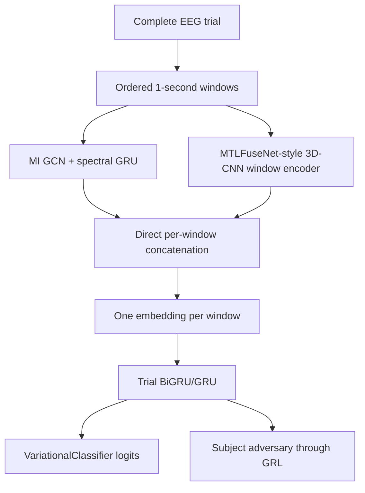

# Subject Invariant Calibrator (SIC)

SIC is an EEG emotion-classification pipeline for measuring cross-subject generalization and rapid user calibration on DREAMER. Each outer fold trains a population model without one target subject, evaluates that subject at zero shot, saves the untouched LOSO model, and then measures how performance changes after fine-tuning the classifier with a small number of the target subject's trials.

The current SIC encoder is deterministic. It does not contain an encoder VAE, a learned \(z\) projection, reparameterized sampling, KL loss on the encoder outputs, a reconstruction loss, or a decoder.

## Experiment goals

The supplied experiments answer four main questions:

1. How well does the population model predict a completely unseen subject?
2. How do 3-, 6-, 9-, and 12-shot calibration affect discrimination and probability calibration?
3. How do ERM, V-REx, and first-order MLDG compare?
4. How much do the GCN-GRU branch, the 3D-CNN branch, and median-rating trials contribute?

The pipeline reports accuracy, balanced accuracy, F1, precision, recall, their macro variants, ROC-AUC, Brier score, and expected calibration error (ECE). The supplied runs use Brier score as the configuration-selection and prediction-diagnostic metric because lower Brier score means better probability predictions.

## Deterministic architecture

SIC now learns at the trial level. The data loader first creates non-overlapping
one-second EEG windows and keeps them in chronological trial order. SIC encodes
each window independently, then learns one representation from the complete
ordered window sequence.



### GCN-GRU branch

The graph branch constructs a mutual-information adjacency matrix from source-training data only. The held-out LOSO subject is never used to estimate this graph.

Band-separated graph convolutions extract spatial/spectral relationships and a spectral GRU combines the band representations. Its output width is

$$
d_g=\texttt{spectral\_gru\_units}.
$$

The supplied scripts use \(d_g=384\).

### MTLFuseNet-style 3D-CNN branch

The loader filters each complete trial into theta/alpha/beta before windowing,
then stores those waveforms in channel-major, band-minor order. The 3D-CNN sums
the three bands into the raw-like 4--30 Hz signal used by MTLFuseNet's
spatio-temporal branch and scatters each timestep onto the DREAMER 9x9
electrode grid. Its convolutions span time and both scalp axes. Max pooling and
final averaging act only on the two spatial axes, so all 128 time samples
remain aligned with the graph branch.
The branch width is the final convolution's filter count:

$$
d_c=\texttt{cnn3d\_filters}[-1].
$$

The supplied scripts use filters `[32, 64, 128]`, spatial pool sizes
`[2, 2, 1]`, and a temporal kernel of 7. Layer normalization is used instead
of batch normalization because subject-disjoint batches can be small.

### Direct concatenation

After temporal alignment, the complete branch vectors are concatenated along the feature axis:

$$
h_{\text{joint},t}=[h_{\text{GCN-GRU},t};h_{\text{3D-CNN},t}],
\qquad
d_{\text{joint}}=d_g+d_b.
$$

There is no Dense layer, posterior head, or learned fusion network between the
encoders and this concatenation. Global average pooling removes only the
reduced encoder-time axis inside each individual EEG window:

$$
e_w=\frac{1}{T'}\sum_{t=1}^{T'}h_{\text{joint},w,t}.
$$

For a trial containing `W` windows, these embeddings are reshaped without
reordering into

$$
E_{\text{trial}}=[e_1,e_2,\ldots,e_W]
\in\mathbb{R}^{W\times d_{\text{joint}}}.
$$

The within-window pooling does not mix different EEG windows and does not reduce
the feature width. Most importantly, SIC no longer computes

$$
\frac{1}{W}\sum_{w=1}^{W}e_w.
$$

Instead, the complete ordered sequence `E_trial` enters the recurrent
trial classifier.

| Configuration | GCN-GRU width | 3D-CNN width | Concatenated width |
| --- | ---: | ---: | ---: |
| Model defaults (`cnn3d_filters=[32,64,128]`) | 384 | 128 | 512 |
| `no_cnn3d` | 384 | — | 384 |
| `no_gcn_gru` | — | 128 | 128 |

At least one encoder branch must remain active.

### Trial GRU/BiGRU classifier and subject adversary

The dense hidden classifier stack has been removed. The trial classifier is
imported from `rnn_architectures.py` and accepts either one repeated scalar
width or one explicit width per recurrent layer. The supplied scripts use:

$$
H_1=\operatorname{BiGRU}_{128}(e_1,e_2,\ldots,e_W),
\qquad
r_{\text{trial}}=\operatorname{BiGRU}_{64}(H_1).
$$

The first layer returns the complete ordered sequence with width 256. The final
layer returns concatenated 64-dimensional forward and backward states, so the
trial representation has width 128. Every window can influence the learned
state, but the BiGRU still compresses the sequence into one trainable trial
representation; it does not arithmetically average the windows.

The recurrent state goes directly to one `VariationalClassifier` logits head.
The subject head receives the same recurrent trial representation through
gradient reversal. In the optional window-classification mode, the trial RNN is
bypassed and each window embedding goes directly to the VC head; the supplied
scripts deliberately use trial mode.

The `VariationalClassifier` is the sole emotion-classification head. There is no parallel dense focal head: its one logits tensor is used for prediction, focal loss, and the joint VC objective. This is distinct from variational autoencoding:

- it operates inside the final classifier objective;
- its learned class parameters update during source training and subject calibration;
- it does not replace or reduce the GCN-GRU or 3D-CNN outputs;
- it does not create the encoder's fused representation; and
- it does not reconstruct EEG.

The recurrent classifier settings are:

| Setting | Supplied scripts | Meaning |
| --- | ---: | --- |
| `classifier_rnn_type` | `bigru` | `bigru` or unidirectional `gru` |
| `classifier_rnn_units` | Fixed `[128, 64]` | Units per direction for each recurrent layer |
| `n_classifier_rnn_layers` | 2 | Must match the width-list length; inferred when omitted |
| `classifier_rnn_dropout` | 0.20 | Dropout after each recurrent layer |

In JSON, write the architecture as:

```json
"classifier_rnn_units": {"fixed": [128, 64]}
```

The parser also treats a plain `[128, 64]` as a fixed sequence. To compare
architectures, use an explicit grid such as
`{"grid": [[128], [128, 64]]}` and omit
`n_classifier_rnn_layers` so each candidate's depth is inferred.

The encoder 3D-CNN and classifier BiGRU operate at different levels:

- `cnn3d_filters` controls the spatio-temporal branch inside each one-second
  window; its final value is the branch feature width.
- `classifier_rnn_units` controls the recurrent classifier across the ordered
  sequence of windows in a full trial.
- Both encoder branches explicitly model spatial structure: the GCN uses its
  source-only MI graph and the 3D-CNN uses the fixed scalp grid. The BiGRU then
  models temporal dependencies across the complete fused trial sequence.

The primary supervised classifier term is focal loss:

$$
L_{\text{focal}}
=
-\alpha_t(1-p_t)^\gamma\log p_t.
$$

The ordinary source objective is approximately

$$
L_{\text{source}}
=
w_{\text{VC}}L_{\text{focal+VC}}
+
w_{\text{subject}}L_{\text{subject}}
+
L_{\text{regularization}}.
$$

There is no encoder-VAE or reconstruction term in this objective.

## Source-training methods

Select the source method with `--training-method` or the scripts' `TRAINING_METHOD` environment variable.

### ERM

ERM minimizes the source objective using ordinary batches of complete trials:

```bash
TRAINING_METHOD=erm sbatch full_run_sic_mldg_brier_ablations.sh
```

### V-REx

V-REx treats source subjects as environments. If \(R_s\) is the focal risk for subject \(s\), it adds

$$
L_{\text{V-REx}}
=
L_{\text{source}}
+
\lambda_{\text{V-REx}}\operatorname{Var}(R_1,\ldots,R_S).
$$

Use `VREX_PENALTY_WEIGHT` to set the penalty weight:

```bash
TRAINING_METHOD=vrex VREX_PENALTY_WEIGHT=1.0 \
  sbatch full_run_sic_mldg_brier_ablations.sh
```

### First-order MLDG

MLDG forms complete-trial episodes with disjoint subject groups:

- A: meta-train subjects;
- B: rotating virtual-unseen meta-test subjects.

For each episode:

1. Compute the complete source objective on A.
2. Take a temporary inner step with `mldg_inner_learning_rate`.
3. Evaluate focal emotion classification on B at the temporary parameters.
4. Restore the original parameters.
5. Apply one persistent optimizer update using the A gradient plus `mldg_meta_test_weight` times the B gradient.

The temporary inner update is detached, so the implementation is first-order MLDG and does not compute Hessians.

The MLDG implementation is separated into `MetaLearning.py`. That module owns the complete-trial episode sequence, MLDG fit adapter, temporary inner update, gradient combination, and gradient-cosine diagnostic. `sic_model.py` delegates its MLDG update to that module.

The supplied scripts use 18 A subjects, 4 B subjects, and one complete trial per selected subject. This requires all 22 non-target DREAMER subjects to remain in the source-training pool.

### What batch size means in trial mode

The supplied scripts use `--classification-level trial`. Consequently,
`--source-batch-size 16` means up to 16 complete grouped trials for ERM or
V-REx—not 16 one-second windows. Each sample already contains its full ordered
window sequence. `--calibration-batch-size 8` likewise counts complete target
trials.

During MLDG, `--source-batch-size` does not determine an episode. Episode
contents are controlled by `mldg_meta_train_subjects`,
`mldg_meta_test_subjects`, and `mldg_trials_per_subject`. With A=18, B=4, and
one trial per subject, an episode contains 18 complete A trials and four
complete B trials, with subjects disjoint between the two groups.

## Strict LOSO and zero-shot model saving

For every hyperparameter configuration and target subject:

1. Exclude all data from the target subject.
2. Build the MI graph from source-training features only.
3. Train a fresh source model on the remaining subjects.
4. Evaluate the untouched model on all target trials.
5. Save that exact zero-shot source model as a native `.keras` file.
6. Restore the same source weights independently for every calibration continuation.

Saved models are written inside each configuration directory:

```text
configuration_####/
└── loso_zero_shot_models/
    └── loso_fold_####_target_<subject>_zero_shot.keras
```

`loso_zero_shot_models.json` records the model paths and load metadata. Load a saved model with `compile=False` before installing a new optimizer for later calibration.

Only the zero-shot LOSO models are saved. Calibrated subject-specific continuations are intentionally not saved because calibration is quick and each fold is reproducible from the source model.

## Target-subject calibration

A calibration shot is one complete target-subject trial, not one window. For every requested `(SHOTS, FOLDS)` pair:

1. Build a seeded target-only calibration/evaluation split.
2. Restore the untouched LOSO source weights.
3. Evaluate zero shot on the fold's evaluation trials.
4. Freeze the window encoders and subject-invariance head while keeping the VC classification head trainable.
5. Optionally unfreeze the complete trial GRU/BiGRU before the VC head.
6. Fine-tune on the calibration trials using a fresh optimizer.
7. Re-evaluate the same held-out evaluation trials.
8. Report paired zero-shot, calibrated, and calibrated-minus-zero-shot metrics.

`calibration_unfreeze_layers=1` adapts only the VC logits head.
`calibration_unfreeze_layers=2` adapts the complete trial GRU/BiGRU and the VC
head together. There are no dense classifier blocks to count.
`calibration_use_vc_target=false` disables only the auxiliary VC regularizers
during calibration; it does not freeze or replace the VC head. Every calibration
fold begins from the same zero-shot model.

The full script evaluates:

| Shots | Folds |
| ---: | ---: |
| 3 | 6 |
| 6 | 3 |
| 9 | 2 |
| 12 | 3 |

The full run selects configurations using 12-shot calibrated Brier score. Change `--hyperparameter-selection-level` to `losocv` to rank by zero-shot LOSO while still running and reporting calibration.

## Prediction diagnostics

Enable source-training diagnostics with:

```bash
--prediction-diagnostics \
--prediction-diagnostics-metric brier_score \
--prediction-diagnostics-every-n-epochs 1 \
--prediction-diagnostics-max-samples 256
```

`--prediction-diagnostics-metric` accepts:

- `accuracy`
- `f1`, `precision`, `recall`
- `macro_f1`, `macro_precision`, `macro_recall`
- `balanced_accuracy`
- `roc_auc`
- `brier_score`
- `ece`

Each diagnostic row stores both `reported_metric` and `reported_metric_value`, along with confidence and class-fraction summaries. Rows are saved to `sic_prediction_diagnostics.csv` and retained in the complete JSON results.

The callback evaluates a fixed approximately class-balanced subset. With the supplied MLDG scripts, `--validation-subjects 0` means diagnostics contain the source-training split only. The target LOSO subject is never used for per-epoch diagnostics.

The worker scripts expose three shell overrides:

```bash
PREDICTION_DIAGNOSTICS_METRIC=ece \
PREDICTION_DIAGNOSTICS_EVERY_N_EPOCHS=5 \
PREDICTION_DIAGNOSTICS_MAX_SAMPLES=512 \
  sbatch full_run_sic_mldg_brier_ablations.sh
```

SIC predictions are deterministic. The scripts therefore do not request latent Monte Carlo samples or variational uncertainty intervals.

## Code organization

| File | Responsibility |
| --- | --- |
| `sic_model.py` | Deterministic window encoders, trial GRU/BiGRU wiring, ERM/V-REx steps, classifier/subject heads, calibration freezing |
| `rnn_architectures.py` | Reusable LSTM, BiLSTM, GRU, and BiGRU builders, including the no-pooling sequence summarizer used by SIC |
| `MetaLearning.py` | SIC MLDG episode sampling, fit adaptation, temporary inner update, first-order gradient combination |
| `sic_model_train.py` | Data loading, grid execution, experiment orchestration, artifact writing |
| `sic_model_args.py` | All CLI flags, JSON decoding, Cartesian-grid expansion, validation, and `SICTrainingConfig` |
| `cross_val.py` | Strict LOSO evaluation, calibration folds, metrics, aggregation, zero-shot model saving |
| `training_outputs.py` | Prediction diagnostics and compact epoch reporting |
| `smoke_test_sic_mldg_brier_ablations.sh` | Two-task trial-BiGRU structural smoke array |
| `full_run_sic_mldg_brier_ablations.sh` | Four-task trial-BiGRU full ablation array |

The training entry point contains no `argparse` definitions. New experiment flags belong in `sic_model_args.py`.

A representative project layout is:

```text
EEGProc/
├── requirements.txt
├── datasets/remove_gamma/
│   ├── dreamer_eeg.npy
│   └── dreamer_labels.npy
├── smoke_test_sic_mldg_brier_ablations.sh
├── full_run_sic_mldg_brier_ablations.sh
└── src/eegproc/deep_learning/
    ├── cross_val.py
    ├── training_outputs.py
    ├── generalize_optimization_strats/
    │   └── MetaLearning.py
    ├── supervised/
    │   ├── rnn_architectures.py
    │   └── variational_classifier.py
    ├── unsupervised/GNN/
    │   └── GCNMTL.py
    └── joint_architectures/SICModel/
        ├── sic_model.py
        ├── sic_model_train.py
        └── sic_model_args.py
```

The scripts default to `$HOME/EEGProc` and `$HOME/EEGProc/venv312`. Override `PROJECT_DIR`, `VENV_DIR`, `EEG_PATH`, or `LABELS_PATH` when necessary.

## Running on Slurm

### Smoke test

```bash
sbatch smoke_test_sic_mldg_brier_ablations.sh
```

The smoke array runs:

| Task | Profile |
| ---: | --- |
| 0 | `full` |
| 1 | `no_cnn3d` |

Defaults are two target subjects, 50 source epochs, 15 calibration epochs, and
10 MLDG episodes per epoch. Override these shell variables for a faster
structural check.

```bash
MAX_SUBJECTS=4 SOURCE_EPOCHS=10 CALIBRATION_EPOCHS=10 \
MLDG_STEPS_PER_EPOCH=10 sbatch smoke_test_sic_mldg_brier_ablations.sh
```

### Full ablation

```bash
sbatch full_run_sic_mldg_brier_ablations.sh
```

The four array tasks are:

| Task | Profile | Change from full |
| ---: | --- | --- |
| 0 | `full` | Both deterministic branches; retain rating-3 trials |
| 1 | `remove_median` | Remove complete trials whose raw target rating is 3 |
| 2 | `no_gcn_gru` | Use only the 3D-CNN branch |
| 3 | `no_cnn3d` | Use only the GCN-GRU branch |

There is no `no_decoder` profile because current SIC has no decoder in any profile.

The full header uses `#SBATCH --array=0-3%2`: four jobs are created, with at most two active simultaneously. Each active task requests two GPUs.

### Smoke-gated full run

```bash
smoke_job=$(sbatch --parsable smoke_test_sic_mldg_brier_ablations.sh)
sbatch --dependency=afterok:"$smoke_job" full_run_sic_mldg_brier_ablations.sh
```

Slurm holds the full array until all smoke tasks finish successfully.

### Valence and arousal

Valence is the default. To run arousal:

```bash
TARGET_DIMENSION=arousal sbatch full_run_sic_mldg_brier_ablations.sh
```

The target dimension is included in the output path and run name.

### Resubmitting one profile

```bash
sbatch --array=2 full_run_sic_mldg_brier_ablations.sh
```

Task 2 is the `no_gcn_gru` profile.

## Hyperparameter grid size

The full script searches:

- `cnn3d_filters`: start with fixed `[32, 64, 128]`; compare a smaller
  `[16, 32, 64]` only after the baseline completes;
- `focal_gamma`: 0, 1, 2; and
- `vc_beta`: 0.5, 1.5, 2.5.

This produces:

| Profile | Candidates |
| --- | ---: |
| `full` | 27 |
| `remove_median` | 27 |
| `no_gcn_gru` | 27 |
| `no_cnn3d` | 9 |
| Total per target dimension and training method | 90 |

Every candidate performs the configured target-subject LOSO folds and calibration levels. Run the smoke suite before launching the complete grid.

## Output reports

The run root contains the resolved training configuration, submitted grid, progress state, ranked results, and best hyperparameters. Each `configuration_####/` directory contains:

- `model_config.json`
- `dataset_ablation.json`
- `sic_calibration_results.json`
- `sic_overall_metrics.json`
- `sic_subject_summary.csv`
- `sic_calibration_folds.csv`
- `sic_prediction_diagnostics.csv` when diagnostics are enabled
- `sic_window_predictions.csv`
- `sic_trial_predictions.csv`
- `loso_zero_shot_models.json`
- `loso_zero_shot_models/*.keras`

Important aggregate groups include:

- `zero_shot_all_trials_mean_scores`
- `zero_shot_all_trials_std_scores`
- `calibration_levels.<shots>.paired_zero_shot_mean_scores`
- `calibration_levels.<shots>.calibrated_mean_scores`
- `calibration_levels.<shots>.delta_mean_scores`

Brier score is minimized. Most discrimination metrics are maximized.

## Early stopping and MLDG subject counts

The supplied MLDG scripts use:

```text
validation_subjects = 0
A subjects = 18
B subjects = 4
```

This consumes all 22 non-target DREAMER source subjects in every MLDG episode. Early stopping is disabled and all source epochs run.

If source-validation subjects are introduced, reduce `mldg_meta_train_subjects` and/or `mldg_meta_test_subjects` so their sum does not exceed the remaining gradient-training subjects. For example, four source-validation subjects leave 18 gradient-training subjects, so A=14 and B=4 is valid.

## Removed settings

Do not place these obsolete encoder-VAE settings in the JSON configuration:

- `use_decoder`
- `z_log_var_clip_min`
- `z_log_var_clip_max`
- `vae_loss_weight`
- `vae_beta`
- `decoder_dropout`

Deterministic SIC always uses active parallel branches and direct feature concatenation.

The current model does not implement a supervised-contrastive-loss option. Do not add `use_supcon` or `supcon_*` keys unless that feature is implemented in the model first.
